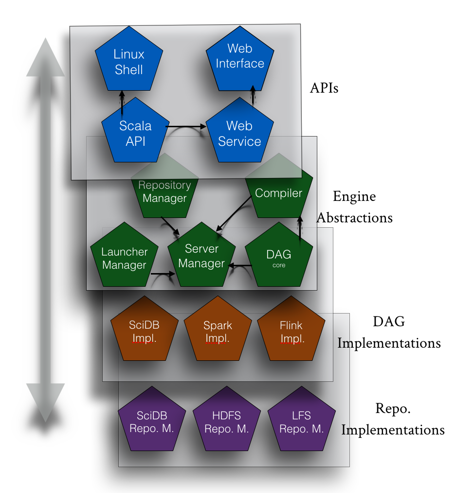
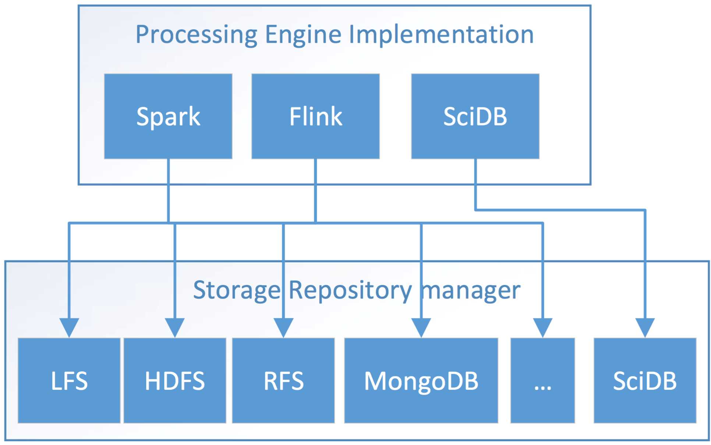
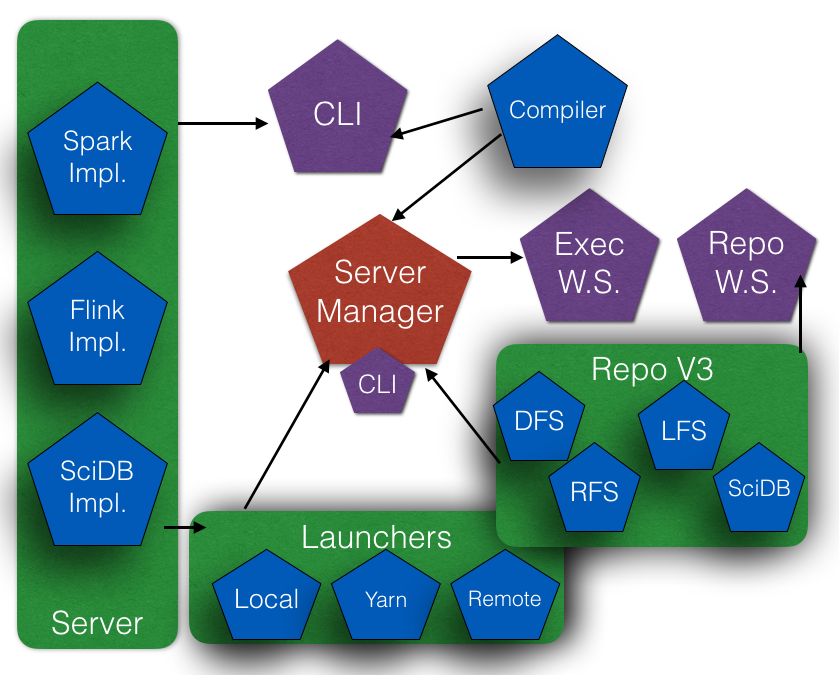
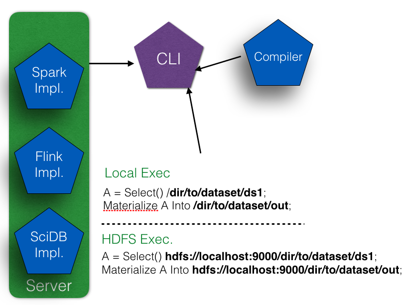
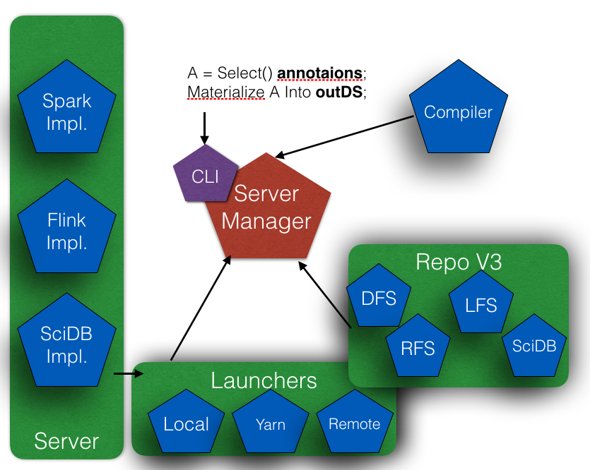
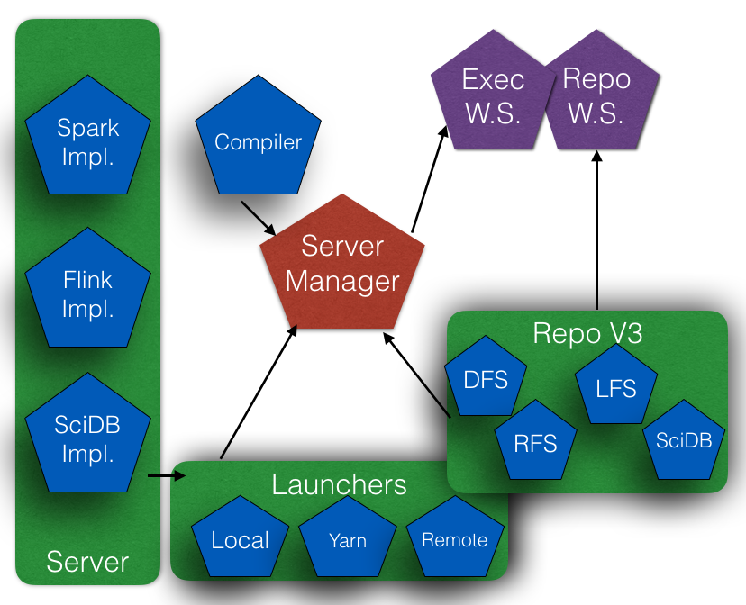

[TOC]

GMQL Architecture
================

GMQL is a **Scalable Data Management Engine for Genomic Data**.  The Engine contains four layers as shown in the figure bellow :
- Access Layer, includes 
	-  Intermediate Representation (IR) APIs,
	-  Shell command line interface,
	-  Web Services,
	-  and Web Interface.
- Engine Abstractions
	- Directed Acyclic Graph (DAG)
	- GMQL Compiler, compiles GMQL script plain text to DAG execution plan.
	- Server Manager, manages the multiuser execution and the workflow of the executors and the repositories
	- Repository Manager, abstracts the APIs for the repositories implementations.
	- Launcher Manager, abstract class of the APIs of the launchers implementations
- Implementations (executors), currently, we have three ready implementations.
	- Spark Implementation (default, and most stable). 
		- This package contains the implementation of the abstract class for DAG nodes. The implementation is written using Apache Spark data flow engine.
	- Flink Implementation, 
		- This package contains the implementation of the abstract class for DAG nodes. The implementation is written using Apache Flink data flow engine.
	- SciDB Implementation: 
		- This package contains the implementation of the abstract class for DAG nodes. The implementation is written using SciDB engine.
- Repositories implementaions
	- Local File System (LFS) repository, used when the installation is for a single machine.
	- HDFS repository, used when Hadoop Distributed File System is selected as the storage 
	- Remote File System (RFS), uses Apache Knox for connecting to remote HDFS. This is suitable when we have Application server for GMQL web interface, and a remote Hadoop cluster for execution and data storage.

Access GMQL web interface is [here](http://genomic.elet.polimi.it/gmql-rest/).
Example of GMQL web services is [here](http://genomic.elet.polimi.it/gmql-rest/help).
For examples on GMQL shell command line click [here](example.md).

## Scripting GMQL  

### Scripting GMQL plain text 
This will use GMQL compiler to compile the plain text into DAG nodes of GMQL. For more information on plain text scripting on GMQL, check [GMQL language Documentation](http://genomic.elet.polimi.it/gmql-rest/gmqlHelp). 

Scripts input and output datasets can be folders or datasets name from the repository; this is dependent on the system deployment (deployment with/without repository). For examples, click [here](example.md)

### GMQL APIs in Scala/Java
GMQL can be used programatically in Scala/Java code by calling GMQL APIs programatically. For more information and examples about calling GMQL API in Scala click [here](GMQL_APIs.md).

## Storage
Apache [Flink](https://flink.apache.org/) and [Spark](http://spark.apache.org/) are data flow engines and can connect to similar storage areas (LFS, DFS, databases, MongoDB, etc.). While SciDB is an array database that itself is a data storage.

We organised the storage to have a [common APIs](../GMQL-Repository/src/main/scala/it/polimi/genomics/repository/GMQLRepository.scala) in the engine core. All the implementations extend a single interface. For information about the datasets, samples, and repository management, see [Repository Manager](../GMQL-Repository/README.md). 

 
## Deployment

GMQL Modules are structured with minimal dependancies as possible, this gives the engine flexibility in the deployment. 

Several deployments are possible for GMQL Engine. The most used three deployments are:
> -  Engine with no repository.
> -  Engine with repository.
> - Web services.

### GMQL Engine Kernel
The access point for GMQL deployment is the Command line interface (CLI). As shown in the figure bellow, the CLI contains the compiler and the engine implementations as dependencies. These modules are usually packed in a JAR, as executable, and run using Spark-Submit (in case of Spark as implementation). 

This package is easy to install, it does not need repository structure and can run independently from GMQL application installation. The user should set the directories of the inputs and outputs in the select and the materialise operations, as shown above. The URI of the dataset will decides the execution mode (LOCAL, YARN) in case of Spark and Flink executors are used. 

### GMQL Engine with repository
This deployment will make life easy for GMQL programmer, no need to remember the locations of the dataset since the repository manager is used. This deployment needs the configuration files to be set adequately to create repository directories and manage the execution history. To check the output of the execution, use the [repository Manager shell commands](SHELL_API.md).

### Web services dependancies
[GMQL web interface](http://genomic.elet.polimi.it/gmql-rest/) uses [GMQL web services](http://genomic.elet.polimi.it/gmql-rest/help). GMQL web services packs all GMQL modules as two parts: The application part, which includes the Server manager, the web services and the repository; and the kernel part that has the executors. This will allow to have the GMQL application independent from the executing platform when deployed.

